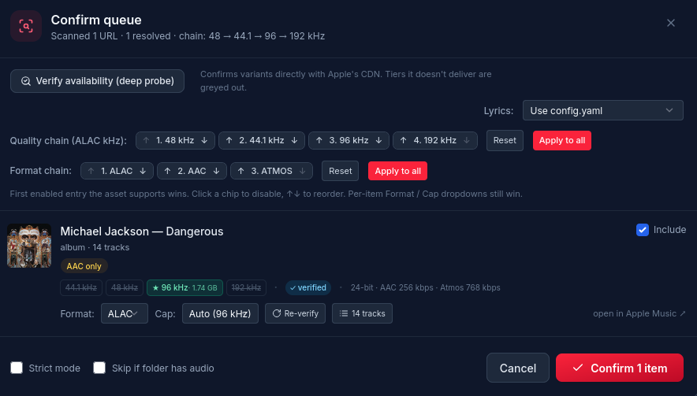
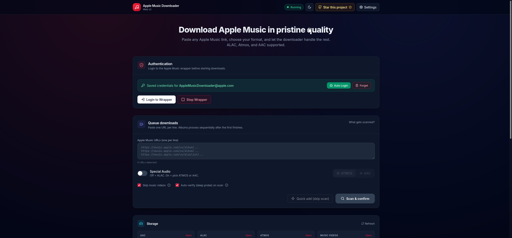
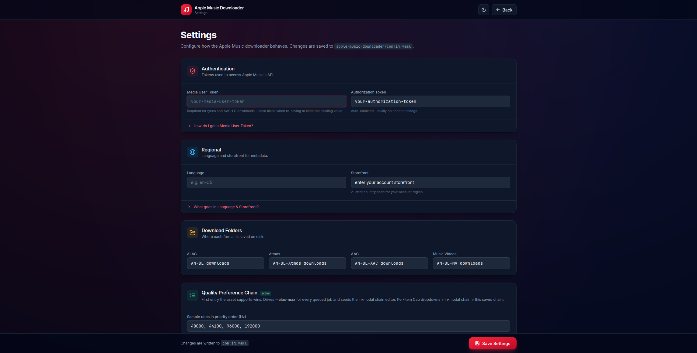

# Apple Music Downloader Web UI

> A modern browser-based interface for Apple Music downloading workflows, powered by `zhaarey/apple-music-downloader` and `WorldObservationLog/wrapper`.


## Important disclaimer

This project is intended for **personal, educational, and interoperability use only**.

You must have:

- A valid Apple Music account.
- An active Apple Music subscription.
- The legal right to access the content you download.

Do not redistribute downloaded content. Respect copyright law and the Apple Media Services Terms and Conditions.

For account safety, it is recommended to use a dedicated Apple Music account rather than your primary personal Apple ID.

> **New here?** Read the **[Full Guide](docs/GUIDE.md)** for complete, beginner-friendly setup, usage, customization, and GitHub upload instructions (Linux/Ubuntu and Windows/WSL2).

## Acknowledgements

This UI would not be possible without these projects:

- **[zhaarey/apple-music-downloader](https://github.com/zhaarey/apple-music-downloader)** - the core downloader used under the hood.
- **[WorldObservationLog/wrapper](https://github.com/WorldObservationLog/wrapper)** - the authentication/session wrapper used for Apple Music login.
- **[lalit22km/alac-rip](https://github.com/lalit22km/alac-rip)** - the original project foundation this improved build is based on.

This version adds UI refinements, safer setup behavior, queue improvements, diagnostics, clearer settings, terminal logging, Skip-MV handling, availability checks, lyrics controls, and quality-of-life changes around the original idea.

## Screenshots

### Download



### Home



### Settings



## Features

- **Modern web UI**
  - Browser-based interface for queueing and managing Apple Music downloads.
  - Responsive layout with dark mode.

- **Format choices**
  - ALAC.
  - AAC.
  - Dolby Atmos / spatial audio when available.

- **Queue-based downloader**
  - Add one or many Apple Music URLs.
  - Scan before downloading.
  - Confirm albums/playlists before queueing.
  - Stop/cancel active jobs.

- **Skip music videos**
  - Helps avoid music-video items that can cause unsupported downloads, retries, or stuck jobs.

- **Auto-verify**
  - Checks availability before queueing so the UI can show which formats are likely to work.

- **Lyrics controls**
  - Standard lyrics mode.
  - Karaoke/syllable-timed lyrics mode when available.
  - Note: Apple Music's own app may not display imported karaoke timing the same way it displays official Apple Music lyrics.

- **Settings UI**
  - Regional/storefront settings.
  - Save folders.
  - Quality chains.
  - Cover art.
  - Lyrics.
  - Tags.
  - Conversion options.
  - Library scan and completion webhooks.

- **System Health**
  - Shows only important readiness information by default.
  - Hides technical details in an expandable section.
  - Avoids alarming users about save folders that are created automatically.

- **Diagnostics**
  - Download a diagnostics bundle with redacted config, health status, and logs.

- **Terminal logs**
  - Wrapper logs are printed to the terminal.
  - Downloader logs are mirrored to the terminal with job prefixes.
  - HTTP access logs are printed while the server is running.

## Supported platforms

### Linux

This project is designed for Linux.

The automatic first-run installer currently supports **apt-based Linux distributions** because it uses `apt-get` and `apt-cache` to install system dependencies.

The bundled setup targets **x86_64/amd64 Linux**. This is because the wrapper, Bento4 download, and pinned Go toolchain used by the installer are Linux x86_64/amd64 builds.

Recommended and tested-style targets:

- Ubuntu 22.04 LTS.
- Ubuntu 24.04 LTS.
- Debian-based distributions with `apt-get` and `apt-cache`.
- Newer Ubuntu/Debian releases should also work, but package availability can vary.

Other Linux distributions may work if you manually provide equivalent dependencies, but the built-in automatic dependency installer is not currently written for `dnf`, `pacman`, `zypper`, or other package managers.

### Virtual machine: VirtualBox / VMware

This is a good option if your main computer is Windows or macOS.

Recommended VM settings:

- Ubuntu Desktop/Server or another Debian-based Linux guest.
- 2 CPU cores or more.
- 4 GB RAM or more.
- 20 GB disk or more.
- NAT networking is fine for local use.
- Bridged networking is useful if you want to access the Web UI from another device on your LAN.

If you run the app inside a VM:

- Use `http://127.0.0.1:5000/` from inside the VM.
- Use the printed `LAN URL` from your host computer if bridged networking is enabled.
- If using NAT, configure port forwarding from host port `5000` to guest port `5000`.

### Windows

Native Windows is **not the recommended setup**.

The project uses Linux-oriented setup steps and Linux binaries from the upstream wrapper workflow. On Windows, use one of these instead:

- Ubuntu in VirtualBox.
- Ubuntu in VMware.
- WSL2 with Ubuntu.

### WSL2

WSL2 can work, especially on Windows 10/11 with Ubuntu installed from the Microsoft Store.

Notes:

- Run commands inside the Linux/WSL terminal. Ubuntu on WSL2 is recommended.
- Open the Web UI from Windows using the printed URL, usually `http://127.0.0.1:5000/`.
- Save paths can be Linux paths like `/home/your-user/Music` or mounted Windows paths like `/mnt/c/Users/YourName/Music`.

### Docker

Docker is **not officially supported in this repository right now**.

There is no included Dockerfile or Compose setup. A Docker setup may be possible, but authentication, persistent config, downloaded files, exposed ports, and wrapper networking need careful handling.

For most users, Linux directly, Ubuntu/Debian in a VM, or WSL2 is much easier.

## Requirements

You need:

- A Linux environment.
- x86_64/amd64 CPU architecture.
- Automatic setup requires an apt-based distribution with `apt-get` and `apt-cache`; Ubuntu/Debian are recommended.
- `python3`.
- `sudo` access.
- Internet access during setup.
- A valid Apple Music subscription.

The installer will automatically install or set up:

- `git`
- `ffmpeg`
- `wget`
- `ca-certificates`
- `python3-pip`
- `python3-venv`
- `gpac` (provides `MP4Box` for embedding music videos / animated artwork) — installed automatically, including a `universe` repo retry
- a pinned Go toolchain
- Python dependencies in a project-local `.venv`
- Bento4
- the wrapper binary
- `zhaarey/apple-music-downloader`

## Quick start on Linux

These commands are for Ubuntu, Debian, and other apt-based Linux systems. Ubuntu LTS is the recommended path for most users.

### 1. Update your system

```bash
sudo apt update
sudo apt upgrade -y
```

### 2. Install the basics

```bash
sudo apt install -y git python3 python3-venv python3-pip ca-certificates
```

Check Python:

```bash
python3 --version
```

If `python3` is not found:

```bash
sudo apt install -y python3
```

If you are on Fedora, Arch, openSUSE, Alpine, or another non-apt distribution, the current automatic installer will not install packages for you. Use an Ubuntu/Debian VM or WSL2 environment for the easiest setup, or manually install equivalent packages and adapt the setup.

### 3. Clone the repository


```bash
git clone https://github.com/losslessbitlab/apple-music-downloader-webui.git
cd apple-music-downloader-webui
```

If you downloaded a ZIP instead:

```bash
unzip project-main.zip
cd project-main
```

### 4. Run the installer and server

```bash
sudo python3 main.py
```

On first run, the script installs missing dependencies and downloads the required upstream tools.

When the server starts, you should see something like:

```text
Web UI: http://127.0.0.1:5000/
Local access only (no authentication). To allow other devices on your LAN, restart with FLASK_HOST=0.0.0.0.
Running waitress WSGI server on 127.0.0.1:5000
```

Open the Web UI in your browser:

```text
http://127.0.0.1:5000/
```

By default the Web UI binds to localhost only, because it has **no authentication**. If you want to reach it from another device on the same network, restart with `FLASK_HOST=0.0.0.0` and use the printed `LAN URL`:

```bash
sudo FLASK_HOST=0.0.0.0 python3 main.py
```

## First-time setup in the Web UI

### 1. Log in to Apple Music

Open the Web UI and use the login/authentication panel.

You need an Apple Music account with an active subscription.

For safety, using a dedicated Apple Music account is recommended instead of your main personal Apple ID.

If Apple asks for two-factor authentication, follow the UI prompts and watch the wrapper log.

### 2. Add a Media User Token

Some features are much more reliable with a Media User Token, especially:

- AAC-LC downloads.
- Lyrics.
- Some availability checks.
- Some regional/availability behavior.

Use the built-in Media User Token help in Settings.

### 3. Review Settings

Open **Settings** and review:

- **Regional settings**
  - Storefront/country behavior.
  - Language.

- **Save folders**
  - Where ALAC, AAC, and Atmos files are saved.
  - Missing folders are not usually a problem; they are created during downloads.

- **Quality**
  - Preferred ALAC sample-rate chain.
  - Atmos max quality.
  - AAC type.

- **Lyrics**
  - Off.
  - Standard synced lyrics.
  - Karaoke/syllable-timed lyrics when available.

- **Tags**
  - Metadata behavior.
  - Playlist caveats.
  - You may still prefer external tagging tools such as MusicBrainz Picard or Mp3tag for final library cleanup.

- **Library & Webhooks**
  - Trigger library scans after successful downloads.
  - Send completion events to tools such as Discord, ntfy.sh, Home Assistant, or Node-RED.

### 4. Download music

Paste one or more Apple Music URLs into the download box.

Supported URL types depend on upstream downloader support, but common examples include:

- Songs.
- Albums.
- Playlists.

> **Important — check the country code in the link.** Apple Music URLs contain a storefront/country code right after the domain, for example the `us` in `https://music.apple.com/us/album/...`. After you log in, your links may default to `/us/`. If your subscription is in another country, change that code to **your** storefront (for example `gb`, `de`, `jp`, `in`):
>
> ```text
> https://music.apple.com/us/album/...   ->   https://music.apple.com/gb/album/...
> ```
>
> Using a storefront that does not match your active subscription is a common cause of "not available" / region errors.

> **You must have an active Apple Music subscription.** This tool downloads from your own subscription's streams — it does not bypass payment. Without an active subscription, downloads will fail.

Choose your target:

- **ALAC**
  - Best for lossless stereo.
  - Recommended default.

- **AAC**
  - Useful when you want smaller files or AAC-specific streams.
  - Media User Token may be required for reliable AAC-LC behavior.

- **Atmos**
  - For Dolby Atmos / spatial audio where Apple provides it.
  - Not every release has Atmos.

Recommended toggles:

- **Skip MV**
  - Leave enabled if you do not want music videos.
  - Helps prevent video items from blocking the queue.

- **Auto-verify**
  - Leave enabled.
  - Checks what Apple is likely to serve before queueing downloads.

### 5. Watch progress

You can monitor progress in:

- The queue cards in the Web UI.
- The wrapper log in the Web UI.
- The terminal where `main.py` is running.

Terminal logs include:

```text
[WRAPPER LOG] ...
[AMD abc12345] ...
[HTTP] 127.0.0.1 GET /health -> 200
```

## Updating

Run these commands from the project folder.

Update everything:

```bash
sudo python3 main.py --update-all
```

Update only the wrapper:

```bash
sudo python3 main.py --update-wrapper
```

Update only `apple-music-downloader`:

```bash
sudo python3 main.py --update-downloader
```

Refresh Python dependencies:

```bash
sudo python3 main.py --update-python-deps
```

Reinstall the pinned Go toolchain:

```bash
sudo python3 main.py --update-go
```

Update without starting the Web UI afterwards:

```bash
sudo python3 main.py --update-all --no-start
```

## Runtime options

### Change host or port

```bash
sudo FLASK_HOST=127.0.0.1 FLASK_PORT=5000 python3 main.py
```

Default:

- `FLASK_HOST=127.0.0.1` (localhost only; the Web UI has no authentication)
- `FLASK_PORT=5000`

To allow access from other devices on your LAN, opt in explicitly:

```bash
sudo FLASK_HOST=0.0.0.0 FLASK_PORT=5000 python3 main.py
```

### Disable browser auto-open

Browser auto-open is skipped by default in many Linux `sudo` situations because desktop browser launching from root is unreliable.

You can explicitly disable it:

```bash
sudo python3 main.py --no-browser
```

or:

```bash
sudo ALAC_RIP_OPEN_BROWSER=0 python3 main.py
```

### Force browser auto-open attempt

```bash
sudo ALAC_RIP_OPEN_BROWSER=force python3 main.py
```

### Disable terminal downloader log mirroring

```bash
sudo ALAC_RIP_TERMINAL_LOGS=0 python3 main.py
```

### Disable HTTP access logs

```bash
sudo ALAC_RIP_ACCESS_LOGS=0 python3 main.py
```

### Startup banner

On startup the app prints a welcome banner with the ASCII logo, the Web UI URL, and quick-start tips. To control it:

```bash
sudo ALAC_RIP_BANNER=0 python3 main.py       # hide the banner (plain URL lines only)
sudo ALAC_RIP_BANNER=plain python3 main.py   # keep the banner but disable colors
```

Colors are also disabled automatically when output is not a terminal or when `NO_COLOR` is set.

## Troubleshooting

### `python3: command not found`

Install Python:

```bash
sudo apt update
sudo apt install -y python3 python3-venv python3-pip
```

Then run:

```bash
sudo python3 main.py
```

### `ModuleNotFoundError: No module named 'flask'`

Refresh the project virtual environment:

```bash
sudo python3 main.py --update-python-deps
```

If it still fails:

```bash
sudo rm -rf .venv
sudo python3 main.py --update-python-deps
sudo python3 main.py
```

### `Embed failed: MP4Box ... not found in $PATH` (or `gpac` skipped)

`MP4Box` comes from the **gpac** suite. The downloader uses it to embed/mux some outputs (music videos, animated artwork). **Plain audio (ALAC/AAC) downloads still work without it** — this message is non-fatal.

Setup installs `gpac` automatically and will even try to enable Ubuntu's `universe` component. If it is still missing, install it manually:

```bash
sudo apt update
sudo apt install -y gpac
MP4Box -version   # verify it is on PATH
```

Then restart the app so it picks up the new tool. If `gpac` is not in your distro's repositories at all, grab an official build from https://gpac.io/downloads/.

### Web UI does not open automatically

This is normal on many Linux systems, especially when running with `sudo`.

Copy the printed URL into your browser:

```text
http://127.0.0.1:5000/
```

### Browser says it cannot connect

Check that the server is still running.

Try:

```bash
sudo python3 main.py
```

If port `5000` is already in use:

```bash
sudo FLASK_PORT=5050 python3 main.py
```

Then open:

```text
http://127.0.0.1:5050/
```

### Settings says `config.yaml` is missing

Run:

```bash
sudo python3 main.py
```

The app has self-repair logic that recreates missing setup components.

If the project was extracted into a nested folder like `alac-rip/alac-rip`, move into the inner folder or re-clone the repository cleanly.

### Downloads fail with availability or region errors

Try:

- Confirm the Apple Music account has an active subscription.
- Check regional/storefront settings.
- Add or refresh the Media User Token.
- Enable Auto-verify.
- Try another format.
- Try another album/song to rule out a region-locked release.

### Lyrics fail

Try:

- Add/refresh Media User Token.
- Check lyrics settings.
- Try standard lyrics instead of karaoke.
- Confirm the song actually has lyrics available from Apple Music.

### Download gets stuck on a music video

Enable **Skip MV** and queue again.

## Diagnostics

Open **System Health** and click **Diagnostics**.

The downloaded diagnostics ZIP contains useful troubleshooting information such as:

- health snapshot
- redacted config
- queue/job logs
- wrapper logs
- environment fingerprint

Sensitive values such as tokens and webhooks are redacted.

## Security notes

- The first setup uses `sudo` because it installs system packages and tools.
- Review the code before running any project as root.
- The Web UI has **no authentication**, so anyone who can reach it can trigger downloads and read logs.
- By default it binds to `127.0.0.1` (localhost only). Only set `FLASK_HOST=0.0.0.0` if you trust your LAN, and never expose it directly to the public internet.
- For remote access, prefer a VPN or SSH tunnel over binding to all interfaces.
- Do not share your Media User Token, Apple credentials, diagnostics bundle, or config file publicly.
- Prefer a dedicated Apple Music account instead of your main personal account.

## How to change the GitHub star button

The header contains a **Star this project** button. It currently points to:

```text
https://github.com/losslessbitlab/apple-music-downloader-webui
```

If your GitHub username or repository name is different, open `app/templates/index.html`, find the line with `id="github-star-link"`, and change the `href` to your real repository URL:

```html
<a id="github-star-link" href="https://github.com/YOUR_USERNAME/YOUR_REPO" target="_blank" rel="noopener"
```

Step-by-step instructions are in the [full guide](docs/GUIDE.md#8-customize-the-star-button).

## GitHub repository description

Short description you can paste into GitHub:

```text
A modern Apple Music Downloader Web UI with queue management, ALAC/AAC/Atmos options, lyrics controls, Skip-MV handling, health checks, diagnostics, and safer Linux setup.
```

## Suggested GitHub topics

Use these topics on GitHub (GitHub allows up to 20):

```text
apple-music
apple-music-downloader
apple-music-webui
alac
lossless-audio
aac
atmos
spatial-audio
music-downloader
downloader
web-ui
flask
python
self-hosted
lyrics
metadata
music-library
linux
ubuntu
wsl2
```

## Project structure

```text
.
├── app/
│   ├── routes.py
│   ├── queue_engine.py
│   ├── default_config.yaml
│   └── templates/
├── main.py
├── requirements.txt
└── README.md
```

Runtime-created folders are intentionally not meant to be committed:

```text
.venv/
apple-music-downloader/
wrapper/
bento4/
config-backups/
```

## License and upstream projects

This repository is a UI/launcher around other projects. Review the licenses and terms of the upstream tools before using or redistributing:

- [zhaarey/apple-music-downloader](https://github.com/zhaarey/apple-music-downloader)
- [WorldObservationLog/wrapper](https://github.com/WorldObservationLog/wrapper)
- [lalit22km/alac-rip](https://github.com/lalit22km/alac-rip)

If you publish your fork, include clear attribution to the upstream projects.

The code in this repository is released under the [MIT License](LICENSE). The MIT License applies only to this project's own code (the Web UI, launcher, queue, diagnostics, and setup helpers). It does **not** relicense the upstream tools listed above, which keep their own licenses and terms. Review those before redistributing or packaging this project.
